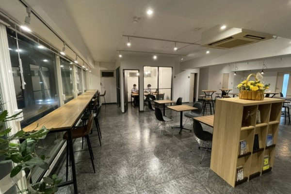

### WWOでは、droppinを使用してお得にワークスペースを使用可能です！
「せっかく沖縄に来たのに仕事なんて・・・」そう思う方もいらっしゃるかと思います。  
そこで、今回は沖縄県内のワークスペースがお得に利用できるアプリクーポン(NTTコミュニケーションズ様提供)をご用意しました。  
  
期間限定のクーポンを利用して、まずはご興味のある施設を体験してみてはいかがでしょうか？  
もちろん、県内の方もご利用可能です！ワークスペースなんて自分には関係ないと思っていた方も是非お試しください。  
  
WWO期間中の16日間で全施設使い放題のクーポンも販売します。vacationよりwork中心の方にとってはかなりお得です。  
南部から北部まで自由にワーケーションを楽しむこともできます。

#### ワーケーションウィークオキナワｘdroppin
##### １　オキナワおためしクーポン
スペース利用料から**2,000円分割引**！  
・スペース利用料金に充当が可能な、「従量課金用割引クーポン」を発行します。  
・利用者がdroppin初回会員登録の場合は、**更に2,000円クーポン**が発行されます。  
・利用可能期間は10月1日～11月30日です。

##### ２　オキナワ使い放題クーポン
スペース利用料が**定額9,800円**！  
・何度でも、何時間でも利用可能な、「定額課金（サブスク）クーポン」を発行します。  
・利用可能期間は11月13日～11月28日です。

##### 使用方法


##### アプリインストール
アプリストアから「droppin」で検索！

[](https://apps.apple.com/jp/app/id1530308628?mt=8)
[](https://play.google.com/store/apps/details?id=com.ntt.dropin&launch=true)
droppin詳細は公式サイトをご確認ください。  
https://nttcom-droppin.com/  
  
#### droppin導入店舗

  

導入店舗は変更になる可能性があります。最新情報はアプリからご確認ください。

  

    

      

        

            
        

        

            
<i class="ti-location-pin text-primary mr-2"></i>那覇市

            <h4 class="card-title"><a href="https://howlive.jp/naha_timesbuilding">howliveタイムスビル店</a></h4>
        

      

    

  

  

    

      

        

            
        

        

            
<i class="ti-location-pin text-primary mr-2"></i>北中城村

            <h4 class="card-title"><a href="https://howlive.jp/share-office/aeon_rycom">howliveイオンモール沖縄ライカム店</a></h4>
        

      

    

  

  

    

      

        

            
        

        

            
<i class="ti-location-pin text-primary mr-2"></i>読谷村

            <h4 class="card-title"><a href="https://howlive.jp/share-office/yomitan_zampa">howlive読谷村残波岬店</a></h4>
        

      

    

  

  

    

      

        

            
        

        

            
<i class="ti-location-pin text-primary mr-2"></i>名護市

            <h4 class="card-title"><a href="https://howlive.jp/share-office/nago_miyazato">howlive名護宮里店</a></h4>
        

      

    

  

  

    

      

        

            
        

        

            
<i class="ti-location-pin text-primary mr-2"></i>宮古島市

            <h4 class="card-title"><a href="https://howlive.jp/share-office/nago_miyazato">howlive宮古島店</a></h4>
        

      

    

  

  

    

      

        

            
        

        

            
<i class="ti-location-pin text-primary mr-2"></i>名護市

            <h4 class="card-title"><a href="https://www.yugaf.com/topics/detail.php?id=262">ハナウール（ホテルゆがふいんおきなわ）</a></h4>
        

      

    

  

  

    

      

        

            
        

        

            
<i class="ti-location-pin text-primary mr-2"></i>名護市

            <h4 class="card-title"><a href="https://iic-miyakojima.jimdofree.com/">宮古島ICT交流センター</a></h4>
        

      

    

  

  

    

      

        

            
        

        

            
<i class="ti-location-pin text-primary mr-2"></i>沖縄市

            <h4 class="card-title"><a href="https://www.microsoft.com/ja-jp/events/azurebase/places/okinawa/">Microsoft Base 沖縄</a></h4>
        

      

    

  

  

    

      

        

            
        

        

            
<i class="ti-location-pin text-primary mr-2"></i>南城市

            <h4 class="card-title"><a href="https://www.yuinchi.jp/lounge/">ユインチホテル南城</a></h4>
        

      

    

  

  

    

      

        

            
        

        

            
<i class="ti-location-pin text-primary mr-2"></i>南城市

            <h4 class="card-title"><a href="https://www.chinenmarine.co.jp/">アガイティーダ（知念海洋レジャーセンター）</a></h4>
        

      

    

  

  

    

      

        

            
        

        

            
<i class="ti-location-pin text-primary mr-2"></i>名護市

            <h4 class="card-title"><a href="http://yagaji-beach.com/">屋我地ビーチ</a></h4>
        

      

    

  

  

    

      

        

            
        

        

            
<i class="ti-location-pin text-primary mr-2"></i>那覇市

            <h4 class="card-title"><a href="https://create-own-life.com/">create own life</a></h4>
        

      

    

  

  

    

      

        

            
        

        

            
<i class="ti-location-pin text-primary mr-2"></i>那覇市

            <h4 class="card-title"><a href="http://her80.jp/">HER80°</a></h4>
        

      

    

  

